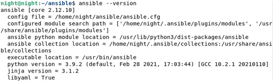
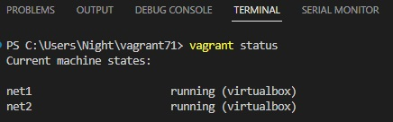
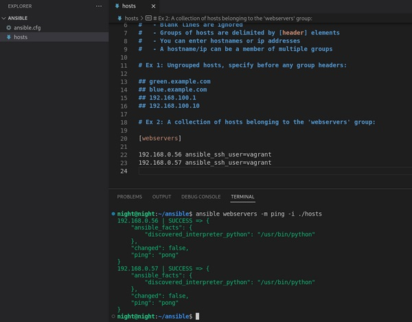
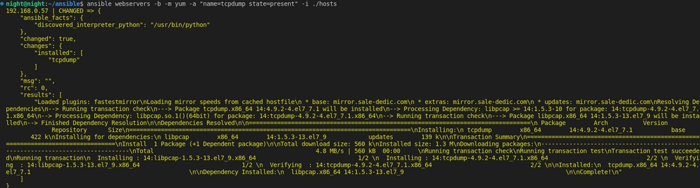
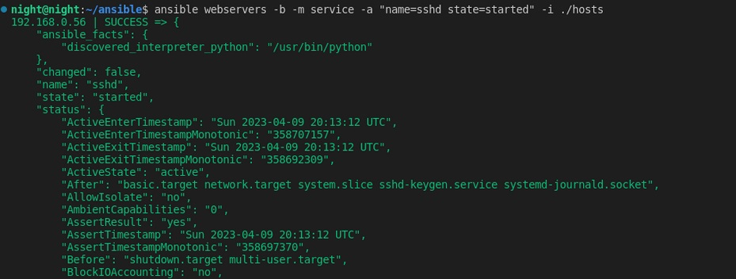
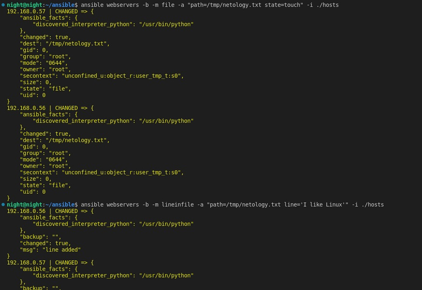
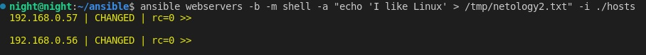

## Ansible. Часть 1
## Домашнее задание. Горбунов Владимир

## Содержание

- [Задание 1. ](#задание-1)
- [Задание 2. ](#задание-2)  
- [Задание 3. ](#задание-3) 
- [Задание 4. ](#задание-4) 

### Задание 1

```
**Ответьте на вопрос в свободной форме.**
Какие преимущества даёт подход IAC?
```

Применение IAC даёт возможность управлять большим количеством серверов с помощью удобных инструментов. Таким образом можно быстро масштабировать инфраструктуру, нет необходимости в ручной настройке, всё выполняется с помощью написания типовых сценариев, конфигов. И производить это всё можно параллельно на всей инфраструктуре. 

### Задание 2 

```
**Выполните действия и приложите скриншоты действий.**
1. Установите Ansible.
2. Настройте управляемые виртуальные машины, не меньше двух.
3. Создайте файл inventory с созданными вами ВМ.
4. Проверьте доступность хостов с помощью модуля ping.
``` 
- Установлен ansible из репозитория deb http://ppa.launchpad.net/ansible/ansible/ubuntu focal main  


- Вагрантом подняты две виртуалки centos7  
[vagrantfile](./vagrantfile)  


- Обе добавлены в хостс, проверен пинг:  
  

### Задание 3 

```
**Ответьте на вопрос в свободной форме.**
Какая разница между параметрами forks и serial? 

```
- Serial определяет количество хостов в группе, на которых будет выполняться плейбук одновременно.
- Forks определяет количество параллельных процессов выполнения задач на одном хосте.
- По умолчанию c версии 2.10 ansible задачи выполняются на всех хостах группы, а если нужно ограничить кол-во хостов, то надо указать нужное значение в параметре Serial. 


### Задание 4 

```
В этом задании вы будете работать с Ad-hoc коммандами.
**Выполните действия и приложите скриншоты запуска команд.**
1. Установите на управляемых хостах любой пакет, которого нет.
2. Проверьте статус любого, присутствующего на управляемой машине, сервиса. 
3. Создайте файл с содержимым «I like Linux» по пути /tmp/netology.txt.
``` 
- Установка тспдампа на хосты:  


- Проверка работы sshd:  


- Создание файла и запись в него строки:  


- Или же просто в одну строку с помощью shell и echo  



