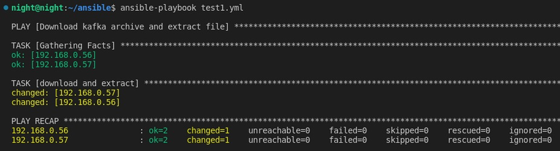
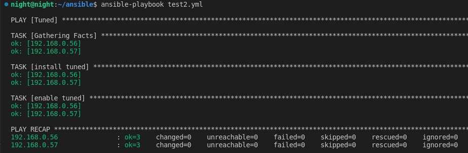
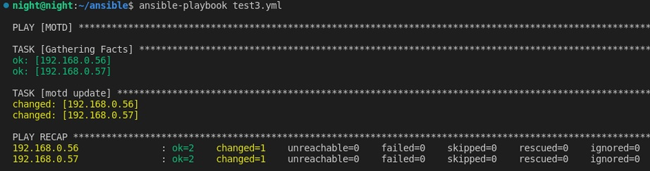
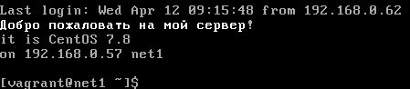
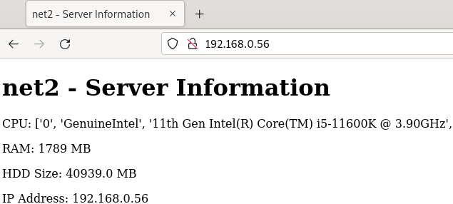
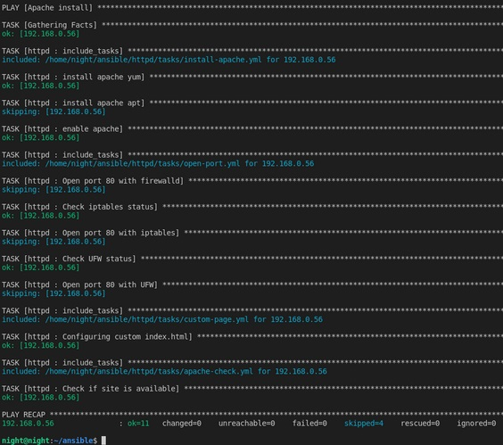

## Ansible. Часть 1
## Домашнее задание. Горбунов Владимир

## Содержание

- [Задание 1. Работа с архивами, установка приложений](#задание-1)
- [Задание 2. Шаблоны. Motd ](#задание-2)  
- [Задание 3. Настройка apache](#задание-3) 

### Задание 1

```
**Выполните действия, приложите файлы с плейбуками и вывод выполнения.**
Напишите три плейбука. При написании рекомендуем использовать текстовый редактор с подсветкой синтаксиса YAML.
Плейбуки должны: 
1. Скачать какой-либо архив, создать папку для распаковки и распаковать скаченный архив. Например, можете использовать [официальный сайт](https://kafka.apache.org/downloads) и зеркало Apache Kafka. При этом можно скачать как исходный код, так и бинарные файлы, запакованные в архив — в нашем задании не принципиально.
2. Установить пакет tuned из стандартного репозитория вашей ОС. Запустить его, как демон — конфигурационный файл systemd появится автоматически при установке. Добавить tuned в автозагрузку.
3. Изменить приветствие системы (motd) при входе на любое другое. Пожалуйста, в этом задании используйте переменную для задания приветствия. Переменную можно задавать любым удобным способом.

```
1. Скачивание архива и распаковка
```
- name: "Download kafka archive and extract file"
  hosts: webservers
  become: true
  tasks:
  - name: "download and extract"
    unarchive:
      src: https://downloads.apache.org/kafka/3.4.0/kafka-3.4.0-src.tgz
      dest: /tmp
      remote_src: yes
```


2. Установка и добавление в автозагрузку tuned
```
- name: "Tuned"
  hosts: webservers
  become: true
  tasks:
  - name: "install tuned"
    ansible.builtin.yum:
      name: tuned
      state: present
  - name: "enable tuned"
    ansible.builtin.service:
      name: tuned
      enabled: true
      state: started
```


3. Изменение приветствия. Motd.
```
плейбук:
- name: "MOTD"
  hosts: webservers
  become: true
  vars:
    motd_greeting: "Добро пожаловать на мой сервер!"
  tasks:
  - name: "motd update"
    template:
      src: templates/motd.j2
      dest: /etc/motd

шаблон  templates/motd.j2:
{{ motd_greeting }}
it is {{ ansible_distribution }} {{ ansible_distribution_version}}
on {{ ansible_all_ipv4_addresses[0] }} 
```


### Задание 2

```
**Выполните действия, приложите файлы с модифицированным плейбуком и вывод выполнения.** 
Модифицируйте плейбук из пункта 3, задания 1. В качестве приветствия он должен установить IP-адрес и hostname управляемого хоста, пожелание хорошего дня системному администратору. 

```
шаблон templates/motd.j2
```
{{ motd_greeting }}
it is {{ ansible_distribution }} {{ ansible_distribution_version}}
on {{ ansible_all_ipv4_addresses[0] }} {{ ansible_hostname }}

```


### Задание 3

```
**Выполните действия, приложите архив с ролью и вывод выполнения.**
Ознакомьтесь со статьёй [«Ansible - это вам не bash»](https://habr.com/ru/post/494738/), сделайте соответствующие выводы и не используйте модули **shell** или **command** при выполнении задания.
Создайте плейбук, который будет включать в себя одну, созданную вами роль. Роль должна:
1. Установить веб-сервер Apache на управляемые хосты.
2. Сконфигурировать файл index.html c выводом характеристик каждого компьютера как веб-страницу по умолчанию для Apache. Необходимо включить CPU, RAM, величину первого HDD, IP-адрес.
Используйте [Ansible facts](https://docs.ansible.com/ansible/latest/playbook_guide/playbooks_vars_facts.html) и [jinja2-template](https://linuxways.net/centos/how-to-use-the-jinja2-template-in-ansible/). Необходимо реализовать handler: перезапуск Apache только в случае изменения файла конфигурации Apache.
4. Открыть порт 80, если необходимо, запустить сервер и добавить его в автозагрузку.
5. Сделать проверку доступности веб-сайта (ответ 200, модуль uri).

В качестве решения:
- предоставьте плейбук, использующий роль;
- разместите архив созданной роли у себя на Google диске и приложите ссылку на роль в своём решении;
- предоставьте скриншоты выполнения плейбука;
- предоставьте скриншот браузера, отображающего сконфигурированный index.html в качестве сайта.
```

[./apache.yml](./apache.yml)  
Роль:  
[./httpd/](./httpd/)  

  
