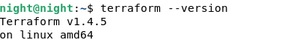
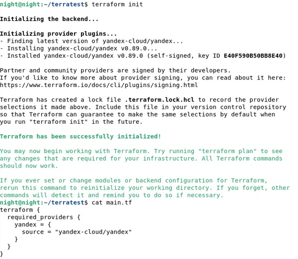
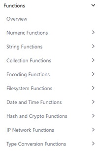

## Terraform. Часть 1
## Домашнее задание. Горбунов Владимир

## Содержание

- [Задание 1. ](#задание-1)
- [Задание 2. ](#задание-2)  
- [Задание 3. ](#задание-3) 
- [Задание 4. ](#задание-4) 
- [Задание 5. ](#задание-5) 

### Задание 1

```
**Ответьте на вопрос в свободной форме.**
Опишите виды подхода к IaC:
 * функциональный;
 * процедурный;
 * интеллектуальный.

```
- Функциональный подход ориентирован на описание желаемого конечного состояния инфраструктуры, скрывая детали реализации и зависимости между компонентами.

- Процедурный подход описывает шаги и порядок действий, необходимых для достижения требуемого состояния.

- Интеллектуальный подход позволяет системе самостоятельно анализировать и принимать решения на основе определенных правил и политик, с использованием анализа данных.


### Задание 2

```
**Ответьте на вопрос в свободной форме.**
Как вы считаете, в чём преимущество применения Terraform?

``` 
Терраформ - устоявшийся продукт, который существует уже довольно давно, широко распространен, соответственно легко можно найти способы решения какой-либо задачи,  применим для большинства облачных провайдеров. Создается и поддерживается одним из лидеров в области IaC. Хорошая документация.


### Задание 3

```
**Ответьте на вопрос в свободной форме.**
Какие минусы можно выделить при использовании IaC?

```

Из минусов IaC: сложность создания и поддержки инфраструктурного кода, возможные ошибки в описании, которые могут вывести инфраструктуру из строя. Конкретно терраформом должен управлять по сути один человек. Могут возникать ситуации несовместимости при работе с API провайдеров, когда какие-то решения уже реализованы провайдером, а в инструменте их нет, или они работают неправильно. 
Терраформ разработан для взаимодействия с облачными провайдерами, и непригоден для работы с VPS/VDS. 


### Задание 4

```
**Выполните действия и приложите скриншоты запуска команд.**
Установите Terraform на компьютерную систему (виртуальную или хостовую), используя лекцию или [инструкцию](https://learn.hashicorp.com/tutorials/terraform/install-cli).    

В связи с недоступностью ресурсов для загрузки Terraform на территории РФ, вы можете  воспользоваться VPN или использовать зеркало из репозитория по [ссылке](https://github.com/netology-code/devops-materials).
```
- Установил через apt (vpn)  
  
  


### Задание 5

```
**Ответьте на вопрос в свободной форме.**
Перечислите основные функции, которые могут использоваться в Terraform. 
```
  

Cтатью на хабре прочитал, огромное количество различных функций на все случаи жизни.
Для обработки чисел, строк, времени, преобразование типов,  кодирования, работы с сетями.
