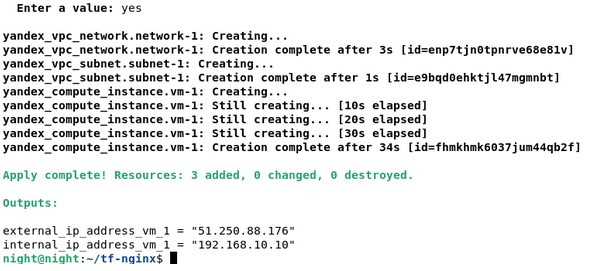
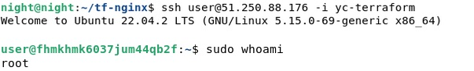
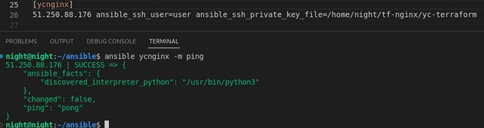
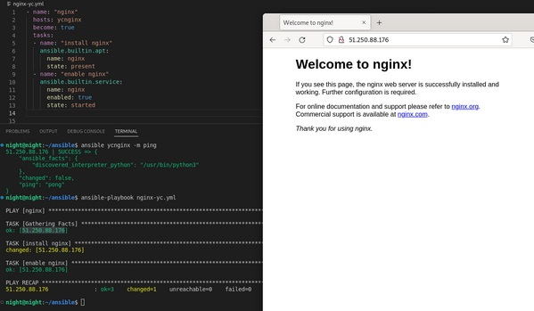
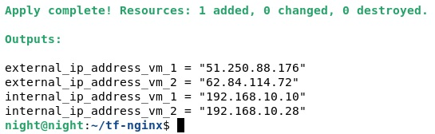
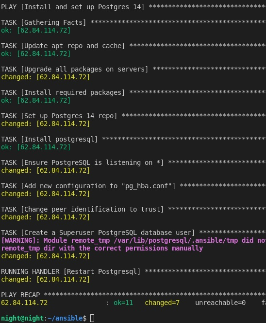
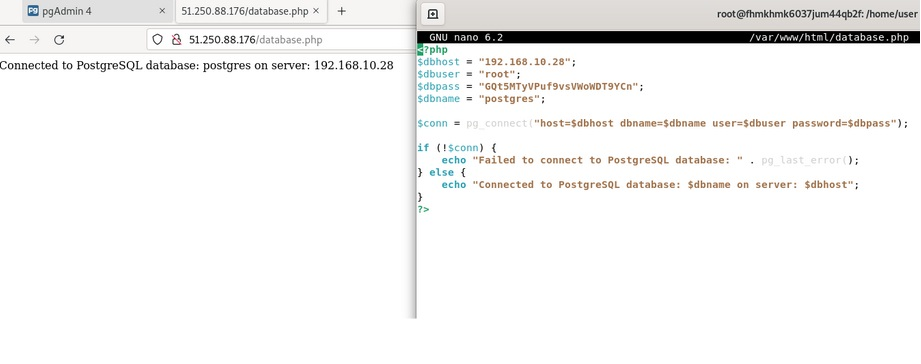

## Terraform. Часть 2
## Домашнее задание. Горбунов Владимир

## Содержание

- [Задание 1. ](#задание-1)
- [Задание 2. ](#задание-2)  

### Задание 1 

<details>
  <summary>Задание</summary> 

```
**Выполните действия, приложите скриншот скриптов, скриншот выполненного проекта.**
От заказчика получено задание: при помощи Terraform и Ansible собрать виртуальную инфраструктуру и развернуть на ней веб-ресурс. 
В инфраструктуре нужна одна машина с ПО ОС Linux, двумя ядрами и двумя гигабайтами оперативной памяти. 
Требуется установить nginx, залить при помощи Ansible конфигурационные файлы nginx и веб-ресурса. 
Секретный токен от yandex cloud должен вводится в консоли при каждом запуске terraform.
Для выполнения этого задания нужно сгенирировать SSH-ключ командой ssh-kengen. Добавить в конфигурацию Terraform ключ в поле:
metadata = {
    user-data = "${file("./meta.txt")}"
 }

В файле meta прописать: 
 
 users:
  - name: user
    groups: sudo
    shell: /bin/bash
    sudo: ['ALL=(ALL) NOPASSWD:ALL']
    ssh-authorized-keys:
      - ssh-rsa  xxx

Где xxx — это ключ из файла /home/"name_ user"/.ssh/id_rsa.pub. Примерная конфигурация Terraform:

terraform {
  required_providers {
    yandex = {
      source = "yandex-cloud/yandex"
    }
  }
}

variable "yandex_cloud_token" {
  type = string
  description = "Введите секретный токен от yandex_cloud"
}

provider "yandex" {
  token     = var.yandex_cloud_token #секретные данные должны быть в сохранности!! Никогда не выкладывайте токен в публичный доступ.
  cloud_id  = "xxx"
  folder_id = "xxx"
  zone      = "ru-central1-a"
}

resource "yandex_compute_instance" "vm-1" {
  name = "terraform1"

  resources {
    cores  = 2
    memory = 2
  }

  boot_disk {
    initialize_params {
      image_id = "fd87kbts7j40q5b9rpjr"
    }
  }

  network_interface {
    subnet_id = yandex_vpc_subnet.subnet-1.id
    nat       = true
  }
  
  metadata = {
    user-data = "${file("./meta.txt")}"
  }

}
resource "yandex_vpc_network" "network-1" {
  name = "network1"
}

resource "yandex_vpc_subnet" "subnet-1" {
  name           = "subnet1"
  zone           = "ru-central1-b"
  network_id     = yandex_vpc_network.network-1.id
  v4_cidr_blocks = ["192.168.10.0/24"]
}

output "internal_ip_address_vm_1" {
  value = yandex_compute_instance.vm-1.network_interface.0.ip_address
}
output "external_ip_address_vm_1" {
  value = yandex_compute_instance.vm-1.network_interface.0.nat_ip_address
}

В конфигурации Ansible указать:

* внешний IP-адрес машины, полученный из output external_ ip_ address_ vm_1, в файле hosts;
* доступ в файле plabook *yml поля hosts.

- hosts: 138.68.85.196
  remote_user: user
  tasks:
    - service:
        name: nginx
        state: started
      become: yes
      become_method: sudo

```
Провести тестирование. 

</details>

- Создание ВМ:  

- Проверка подключения:  
  

- Установка и запуск Nginx:  


### Задание 2

```
**Выполните действия, приложите скриншот скриптов, скриншот выполненного проекта.**
1. Перестроить инфраструктуру и добавить в неё вторую виртуальную машину. 
2. Установить на вторую виртуальную машину базу данных. 
3. Выполнить проверку состояния запущенных служб через Ansible.
```
- Добавление второй вм в ту же подсеть:  

- Установка postgres в ансибле:  

- Проверка подключения с вм, на которой nginx на вм с postgres:  

- Плэйбук для установки postgres на ubuntu:
```
---
- name: Install and set up Postgres 14 
  hosts: ycpostgr
  become: yes
  vars:
    postgres_root_user: root
    postgres_root_pass: GQt5MTyVPuf9vsVWoWDT9YCn
    allow_world_readable_tmpfiles: true
  tasks:
    - name: Update apt repo and cache
      apt:
        update_cache: yes
        force_apt_get: yes
        cache_valid_time: 3600

    - name: Upgrade all packages on servers
      apt:
        upgrade: dist
        force_apt_get: yes

    - name: Install required packages
      apt:
        name:
          - wget
          - python3-psycopg2
          - acl
        state: latest

    - name: Set up Postgres 14 repo
      shell: |
        echo "deb http://apt.postgresql.org/pub/repos/apt $(lsb_release -cs)-pgdg main" > /etc/apt/sources.list.d/pgdg.list
        wget --quiet -O - https://www.postgresql.org/media/keys/ACCC4CF8.asc | sudo apt-key add -
      args:
        warn: no

    - name: Install postgresql
      apt:
        name: postgresql-14
        update_cache: yes
      notify:
        - Enable Postgresql

    - name: Ensure PostgreSQL is listening on *
      lineinfile:
        dest: /etc/postgresql/14/main/postgresql.conf
        regexp: '^listen_addresses\s*='
        line: "listen_addresses='*'"
        state: present
      notify: Restart Postgresql

    - name: Add new configuration to "pg_hba.conf"
      blockinfile:
        dest: /etc/postgresql/14/main/pg_hba.conf
        block: |
          host    all             all             0.0.0.0/0                md5
          host    all             all             ::/0                     md5
      notify: Restart Postgresql

    - name: Change peer identification to trust
      shell: /bin/sed -i '/^local/s/peer/trust/' /etc/postgresql/14/main/pg_hba.conf
      args:
        warn: no
      notify: Restart Postgresql

    - name: Create a Superuser PostgreSQL database user
      become: yes
      become_user: postgres
      postgresql_user:
        name: '{{ postgres_root_user }}'
        password: '{{ postgres_root_pass }}'
        role_attr_flags: CREATEDB,SUPERUSER,CREATEROLE
        encrypted: yes
        state: present
  handlers:
    - name: Restart Postgresql
      systemd:
        name: postgresql
        state: restarted

    - name: Start Postgresql
      systemd:
        name: postgresql
        state: started

    - name: Stop Postgresql
      systemd:
        name: postgresql
        state: stopped

    - name: Enable Postgresql
      systemd:
        name: postgresql
        enabled: yes

```
