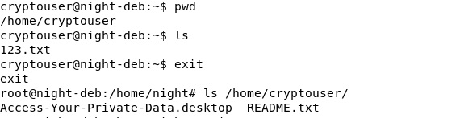
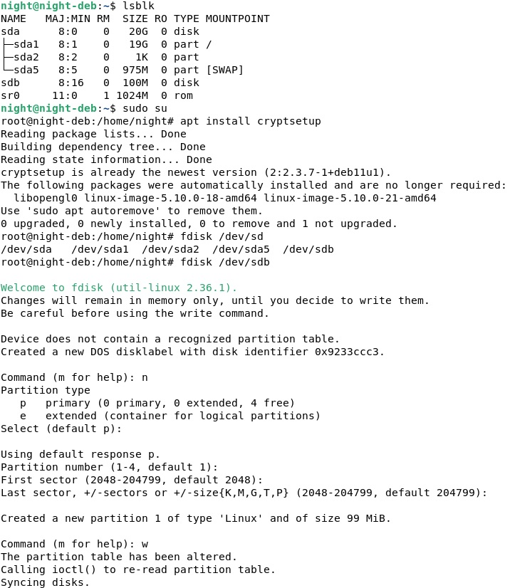
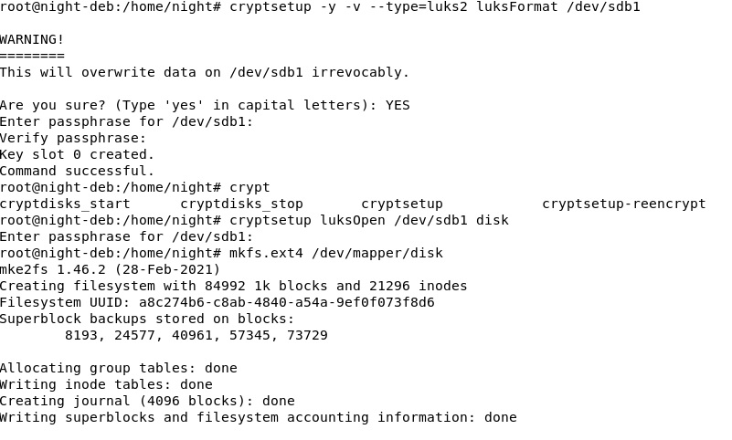
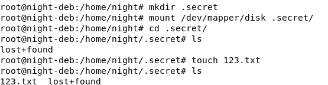
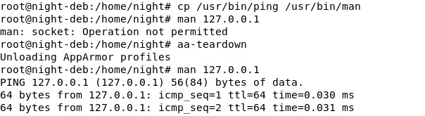

## Защита хоста
## Домашнее задание. Горбунов Владимир

## Содержание

- [Задание 1. eCryptfs](#задание-1)
- [Задание 2. LUKS](#задание-2)  
- [Задание 3. AppArmor](#задание-3)  


### Задание 1
```
1. Установите **eCryptfs**.
2. Добавьте пользователя cryptouser.
3. Зашифруйте домашний каталог пользователя с помощью eCryptfs.
*В качестве ответа  пришлите снимки экрана домашнего каталога пользователя с исходными и зашифрованными данными.*  
```

Команды:
```
apt install ecryptfs-utils  
adduser cryptouser   
ecryptfs-migrate-home --user cryptouser   
```
Вход под юзером cryptouser, создание файла, вход под рутом, проверка, что каталог недоступен:  



### Задание 2
```
1. Установите поддержку **LUKS**.
2. Создайте небольшой раздел, например, 100 Мб.
3. Зашифруйте созданный раздел с помощью LUKS.
*В качестве ответа пришлите снимки экрана с поэтапным выполнением задания.*
```

- К ВМ подключен дополнительный диск 100мб  
- Установка LUKS, форматирование диска:  
```
apt install cryptsetup
fdisk /dev/sdb
```



- Шифрование раздела:  
```
cryptsetup -y -v --type=luks2 luksFormat /dev/sdb1
cryptsetup luksOpen /dev/sdb1 disk
mkfs.ext4 /dev/mapper/disk 
```



- Монтирование в папку:   
```
mkdir .secret
mount /dev/mapper/disk .secret/
```




### Задание 3
```
1. Установите **apparmor**.
2. Повторите эксперимент, указанный в лекции.
3. Отключите (удалите) apparmor.
*В качестве ответа пришлите снимки экрана с поэтапным выполнением задания.*
```

Команды:
```
apt install apparmor-profiles apparmor-utils apparmor-profiles-extra
cp /usr/bin/man /usr/bin/man1
cp /usr/bin/ping /usr/bin/man
man 127.0.0.1

aa-teardown
man 127.0.0.1

service apparmor stop
apt purge apparmor-profiles apparmor-utils apparmor-profiles-extra
```


