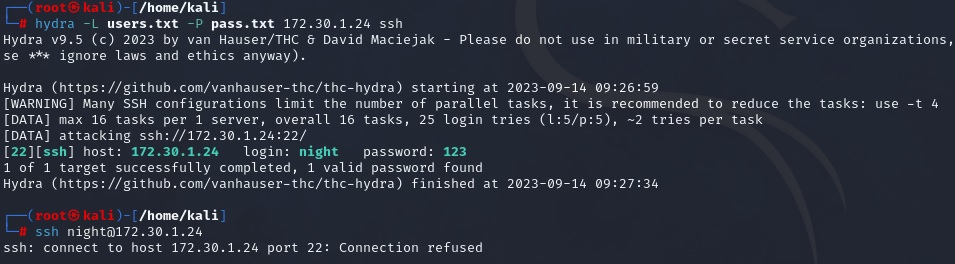

## Защита сети
## Домашнее задание. Горбунов Владимир

## Содержание

- [Задание 1. ](#задание-1)
- [Задание 2. ](#задание-2)  


### Подготовка к выполнению заданий

```
1. Подготовка защищаемой системы:
- установите **Suricata**,
- установите **Fail2Ban**.
2. Подготовка системы злоумышленника: установите **nmap** и **thc-hydra** либо скачайте и установите **Kali linux**.
Обе системы должны находится в одной подсети.
```

### Задание 1

```
Проведите разведку системы и определите, какие сетевые службы запущены на защищаемой системе:
**sudo nmap -sA < ip-адрес >**
**sudo nmap -sT < ip-адрес >**
**sudo nmap -sS < ip-адрес >**
**sudo nmap -sV < ip-адрес >**
По желанию можете поэкспериментировать с опциями: https://nmap.org/man/ru/man-briefoptions.html.
*В качестве ответа пришлите события, которые попали в логи Suricata и Fail2Ban, прокомментируйте результат.*
```

- В Suricata подключены правила et/open
```
suricata-update list-sources
suricata-update enable-source et/open
suricata-update
```
- В настройках  /etc/suricata/suricata.yaml включен мониторинг интерфейса подсети PentestNet enp0s3 и подключены правила
```
...
address-groups:
    HOME_NET: "[192.168.0.0/16,10.0.0.0/8,172.16.0.0/12]"
    EXTERNAL_NET: "any"
...
pcap:
  - interface: enp0s3
...
pfring:
  - interface: enp0s3
...
af-packet:
  - interface: enp0s3

...
default-rule-path: /var/lib/suricata/rules
rule-files:
  - suricata.rules
```

- При всех четырех вариантах запроса nmap -sS -sV -sS -sA в логи suricata попадают только сообщения о подозрительных пингах на порты postgres, mysql и vnc, логи во всех четырех случаях идентичны:  
[./suricata-nmap.log](./suricata-nmap.log)  

Насколько я понял "из коробки" определение nmap сканов в suricata нет, и это решается установкой различных дополнительных правил. 

- На хосте с suricata установил nginx. Запрос с Kali Linux со скриптом для проверки различных user-agent: `nmap -p 80 172.30.1.24 --script=http-useragent-tester`  
В логах отображается информация о том, что было сканирование с помощью nmap:  
[./suricata-nginx.log](./suricata-nginx.log)


### Задание 2

```
Проведите атаку на подбор пароля для службы SSH:
**hydra -L users.txt -P pass.txt < ip-адрес > ssh**
1. Настройка **hydra**: 
  - создайте два файла: **users.txt** и **pass.txt**;
 - в каждой строчке первого файла должны быть имена пользователей, второго — пароли. В нашем случае это могут быть случайные строки, но ради эксперимента можете добавить имя и пароль существующего пользователя.
Дополнительная информация по **hydra**: https://kali.tools/?p=1847.

2. Включение защиты SSH для Fail2Ban:
-  открыть файл /etc/fail2ban/jail.conf,
-  найти секцию **ssh**,
-  установить **enabled**  в **true**.
Дополнительная информация по **Fail2Ban**:https://putty.org.ru/articles/fail2ban-ssh.html.
```

Пробую подобрать пароль с помощью hydra.  
Пароль успешно подобран (т.к. в списке он шёл одним из первых), однако дальнейшее подключение невозможно, т.к. заблокирован IP адрес Kali linux.  


Логи на хосте с fail2ban:  
[./fail2ban.log](./fail2ban.log)

В итоге fail2ban успешно отработал. IP адрес забанен, в логах информация о попытках подключения отобразилась. 

