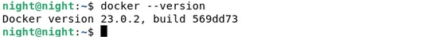
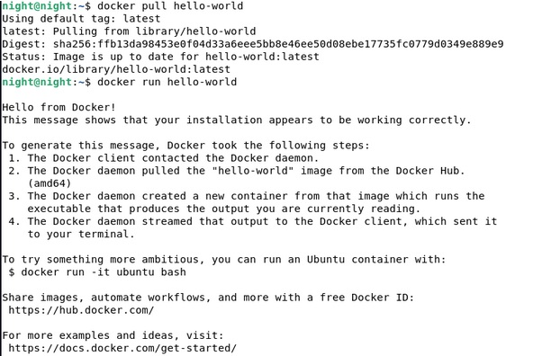
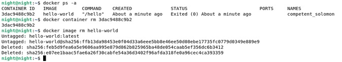
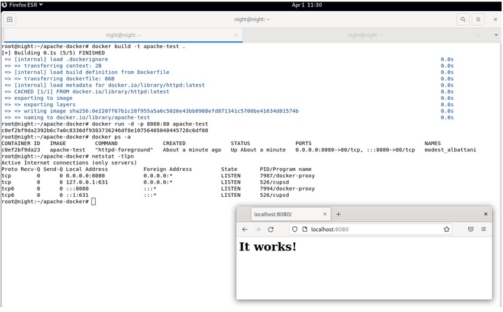
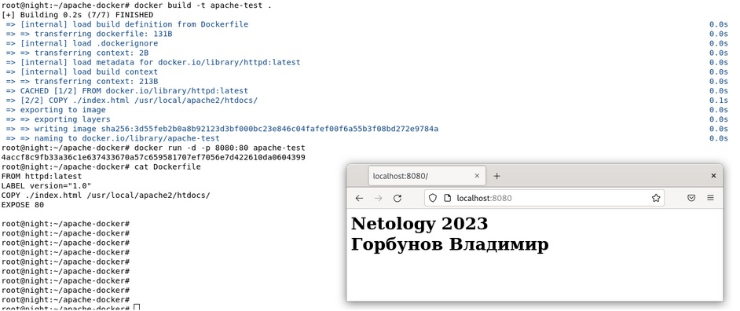

## Docker. Часть 1
## Домашнее задание. Горбунов Владимир

## Содержание

- [Задание 1. Теория](#задание-1)
- [Задание 2. Установка ](#задание-2)  
- [Задание 3. Hello world](#задание-3) 
- [Задание 4.](#задание-4)  
- [Задание 5. Apache](#задание-5) 
- [Задание 6. Dockerfile](#задание-6)  


### Задание 1

```
**Ответьте на вопрос в свободной форме.** 
Чем контейнеризация отличается от виртуализации?

```
- Основное отличие между контейнеризацией и виртуализацией заключается в том, что контейнеры используют единую ОС, тогда как виртуальные машины имеют собственные экземпляры ОС. Контейнеры обеспечивают большую плотность размещения, более высокую скорость запуска и более легкую масштабируемость, в то время как виртуальные машины обеспечивают более высокую изоляцию и безопасность.
- Контейнер представляет собой процесс в операционной системе с изолированным окружением, своими библиотеками и программами, а виртуальная ОС работает на физическом уровне и  получает доступ к ресурсам машины - процессору, памяти и т.д.


### Задание 2 

```
**Выполните действия:**
1. Установите Docker.
1. Приложите скриншот.

```


### Задание 3

```
**Выполните действия:**
1. Запустите образ hello-world.
1. Приложите скриншот.

```


### Задание 4 

```
**Выполните действия:**
1. Удалите образ hello-world.
1. Приложите скриншот.

```


### Задание 5

```
1. Найдите в Docker Hub образ apache и установите его.
1. Приложите:
 * скриншоты сетевых настроек вашей виртуальной машины;
 * скриншоты работающих контейнеров;
 * скриншот браузера, где вы открыли дефолтную страницу вашего apache внутри контейнера.

```


### Задание 6

```
1. Создайте свой Docker образ с Apache2 и подмените стандартную страницу index.html на страницу, содержащую ваши ФИО.
1. Приложите:
 * скриншот содержимого Dockerfile;
 * скриншот браузера, где apache2 из вашего контейнера выводит ваши ФИО.
```
