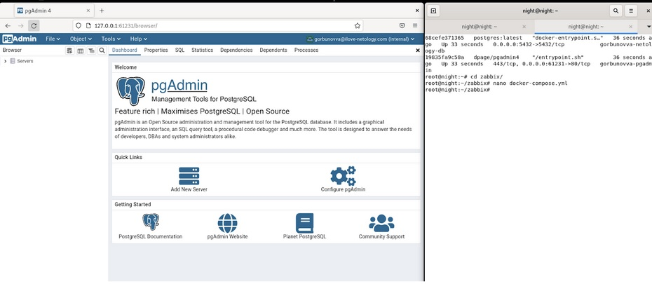
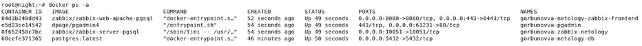
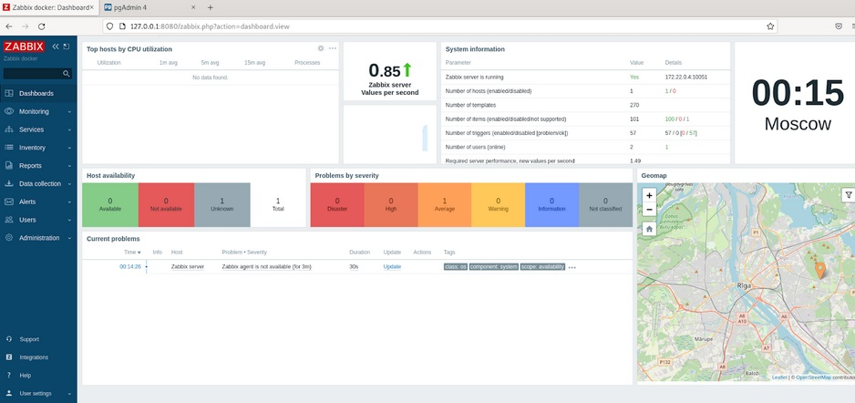
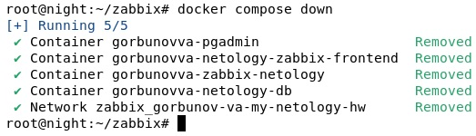

## Docker. Часть 2
## Домашнее задание. Горбунов Владимир

## Содержание

- [Задание 1. Теория](#задание-1)
- [Задание 2. Docker-compose ](#задание-2)  
- [Задание 3. Postgres](#задание-3) 
- [Задание 4. PGadmin](#задание-4)  
- [Задание 5. Zabbix server](#задание-5) 
- [Задание 6. Zabbix frontend](#задание-6)  
- [Задание 7. Порядок запуска контейнеров](#задание-7)  
- [Задание 8. Удаление](#задание-8) 
  
### Задание 1

```
**Напишите ответ в свободной форме, не больше одного абзаца текста.**
Установите Docker Compose и опишите, для чего он нужен и как может улучшить вашу жизнь.

```
- Установился вместе с докером. Нужен, чтобы автоматизировать процесс сборки и работы контейнеров на ноде. По сути всё сводится к написанию yml конфигурации и её последующему дебагу. 

### Задание 2 

```
**Выполните действия и приложите текст конфига на этом этапе.** 
Создайте файл docker-compose.yml и внесите туда первичные настройки: 
 * version;
 * services;
 * networks.
При выполнении задания используйте подсеть 172.22.0.0.
Ваша подсеть должна называться: <ваши фамилия и инициалы>-my-netology-hw.

```

```
version: "3"
services:
networks:
    gorbunov-va-my-netology-hw:
        driver: bridge
        ipam:
            config:
            - subnet: 172.22.0.0/24

```

### Задание 3 

```
**Выполните действия и приложите текст конфига текущего сервиса:** 
1. Установите PostgreSQL с именем контейнера <ваши фамилия и инициалы>-netology-db. 
2. Предсоздайте БД <ваши фамилия и инициалы>-db.
3. Задайте пароль пользователя postgres, как <ваши фамилия и инициалы>12!3!!
4. Пример названия контейнера: ivanovii-netology-db.
5. Назначьте для данного контейнера статический IP из подсети 172.22.0.0/24.

```

```
    postgresdb:
        image: postgres:latest
        container_name: gorbunovva-netology-db
        ports:
            - 5432:5432
        volumes:
            - ./pg_data:/var/lib/postgresql/data/pgdata
        environment:
            POSTGRES_PASSWORD: gorbunovva12!3!!
            POSTGRES_DB: gorbunovva_db
            PGDATA: /var/lib/postgresql/data/pgdata
        networks:
            gorbunov-va-my-netology-hw:
                ipv4_address: 172.22.0.2
        restart: always
```

### Задание 4 

```
**Выполните действия:**
1. Установите pgAdmin с именем контейнера <ваши фамилия и инициалы>-pgadmin. 
2. Задайте логин администратора pgAdmin <ваши фамилия и инициалы>@ilove-netology.com и пароль на выбор.
3. Назначьте для данного контейнера статический IP из подсети 172.22.0.0/24.
4. Прокиньте на 80 порт контейнера порт 61231.
В качестве решения приложите:
* текст конфига текущего сервиса;
* скриншот админки pgAdmin.

```
```
    pgadmin:
        image: dpage/pgadmin4
        container_name: gorbunovva-pgadmin
        environment:
            PGADMIN_DEFAULT_EMAIL: gorbunovva@ilove-netology.com
            PGADMIN_DEFAULT_PASSWORD: 123
        ports:
            - "61231:80"
        networks:
            gorbunov-va-my-netology-hw:
                ipv4_address: 172.22.0.3
        restart: always
```

### Задание 5 

```
**Выполните действия и приложите текст конфига текущего сервиса:** 
1. Установите Zabbix Server с именем контейнера <ваши фамилия и инициалы>-zabbix-netology. 
2. Настройте его подключение к вашему СУБД.
3. Назначьте для данного контейнера статический IP из подсети 172.22.0.0/24.

```
```
    zabbix-server:
        image: zabbix/zabbix-server-pgsql
        links:
            - postgresdb
        container_name: gorbunovva-zabbix-netology
        environment:
            DB_SERVER_HOST: '172.22.0.2'
            POSTGRES_USER: postgres
            POSTGRES_PASSWORD: gorbunovva12!3!!
        ports:
            - "10051:10051"
        networks:
            gorbunov-va-my-netology-hw:
                ipv4_address: 172.22.0.4
        restart: always

```

### Задание 6

```
**Выполните действия и приложите текст конфига текущего сервиса:** 
1. Установите Zabbix Frontend с именем контейнера <ваши фамилия и инициалы>-netology-zabbix-frontend. 
2. Настройте его подключение к вашему СУБД.
3. Назначьте для данного контейнера статический IP из подсети 172.22.0.0/24.
```
```
    zabbix_wgui:
        image: zabbix/zabbix-web-apache-pgsql
        links:
            - zabbix-server
        container_name: gorbunovva-netology-zabbix-frontend
        environment:
            DB_SERVER_HOST: '172.22.0.2'
            POSTGRES_USER: 'postgres'
            POSTGRES_PASSWORD: gorbunovva12!3!!
            ZBX_SERVER_HOST: "172.22.0.4"
            PHP_TZ: "Europe/Moscow"
        ports:
            - "8080:8080"
            - "443:8443"
        networks:
            gorbunov-va-my-netology-hw:
                ipv4_address: 172.22.0.5
        restart: always
```
### Задание 7 

```
**Выполните действия.**
Настройте линки, чтобы контейнеры запускались только в момент, когда запущены контейнеры, от которых они зависят.
В качестве решения приложите:
* текст конфига **целиком**;
* скриншот команды docker ps;
* скриншот авторизации в админке Zabbix.

```
```
version: "3"
services:
    postgresdb:
        image: postgres:latest
        container_name: gorbunovva-netology-db
        ports:
            - 5432:5432
        volumes:
            - ./pg_data:/var/lib/postgresql/data/pgdata
        environment:
            POSTGRES_PASSWORD: gorbunovva12!3!!
            POSTGRES_DB: gorbunovva_db
            PGDATA: /var/lib/postgresql/data/pgdata
        networks:
            gorbunov-va-my-netology-hw:
                ipv4_address: 172.22.0.2
        restart: always
    pgadmin:
        image: dpage/pgadmin4
        links:
            - postgresdb
        container_name: gorbunovva-pgadmin
        environment:
            PGADMIN_DEFAULT_EMAIL: gorbunovva@ilove-netology.com
            PGADMIN_DEFAULT_PASSWORD: 123
        ports:
            - "61231:80"
        networks:
            gorbunov-va-my-netology-hw:
                ipv4_address: 172.22.0.3
        restart: always
    zabbix-server:
        image: zabbix/zabbix-server-pgsql
        links:
            - postgresdb
        container_name: gorbunovva-zabbix-netology
        environment:
            DB_SERVER_HOST: '172.22.0.2'
            POSTGRES_USER: postgres
            POSTGRES_PASSWORD: gorbunovva12!3!!
        ports:
            - "10051:10051"
        networks:
            gorbunov-va-my-netology-hw:
                ipv4_address: 172.22.0.4
        restart: always
    zabbix_wgui:
        image: zabbix/zabbix-web-apache-pgsql
        links:
            - zabbix-server
        container_name: gorbunovva-netology-zabbix-frontend
        environment:
            DB_SERVER_HOST: '172.22.0.2'
            POSTGRES_USER: 'postgres'
            POSTGRES_PASSWORD: gorbunovva12!3!!
            ZBX_SERVER_HOST: "172.22.0.4"
            PHP_TZ: "Europe/Moscow"
        ports:
            - "8080:8080"
            - "443:8443"
        networks:
            gorbunov-va-my-netology-hw:
                ipv4_address: 172.22.0.5
        restart: always
networks:
    gorbunov-va-my-netology-hw:
        driver: bridge
        ipam:
            config:
            - subnet: 172.22.0.0/24
```
  
  


### Задание 8 

```
**Выполните действия:** 
1. Убейте все контейнеры и потом удалите их.
1. Приложите скриншот консоли с проделанными действиями.
```
  
